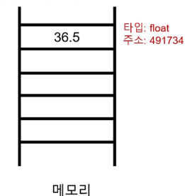

## 표현식과 값
### 표현식(Expression)
하나의 '값'으로 평가될 수 있는 모든 코드

* 3+5
* x > 10
* 5 *4

### 값 (Value)
표현식이 평가된 결과, 더 이상 계산되거나 평가될 수 없는, 프로그램의 가장 기본적인 데이터 조각
> 평가: 표현식을 계산하여 그 결과인 '값'을 만들어내는 과정

* 숫자 값: 103.14
* 문자열 값: "안녕하세요"
* 불리언(Boolean) 값: True, Flase

### 변수(Variable)
값을 나중에 다시 사용하기 위해, 그 값에 붙여주는 고유한 이름

* 변수 할당: 표현식이 만들어 낸 값에 이름을 붙이는 과정(연결)

```Python
degrees = 36.5
```
* 변수 이름: degrees
* = : 할당 연산자(오른쪽 표현식의 평과 결과 값을 왼쪽 변수에 저장)
* 36.5 = 표현식
* "="는 수학에서의 같다가 아니라 오른쪽의 값을 왼쪽 변수에 할당한다는 뜻!

> 변수명 규칙
> * 영문 알파벳, 언더스코어(_), 숫자로 구성
> 숫자로 시작할 수 없음
> 대소문자를 구분
> 파이썬 내부 예약어는 사용 불가능

### 변수, 값, 메모리
* 거래에 집 주소가 있듯이 메모리의 모든 위치에는 그 위치를 고유하게 식별하는 메모리 주소가 존재한다.


* 고유한 ID(메모리 주소)
  * 제품의 바코드
* 타입 (Type)
  * 제품의 종류 (정수, 실수, 문자열 등)
* 값 (Value)
  * 제품의 실제 내용물
* 값+타입+주소 정보를 묶은 것을 객체(Object)라고 부름
* 변수는 특정 개체를 '가리키는(refer/point to)'이름표
  * 변수는 메모리 주소(contain)를 가지지 않음. 참조를 함.

> 즉, 변수는 값을 나중에 다시 사용하기 위해 그 값에 붙여주는 고유한 이름, **"객체를 가리키는 이름"**

### 할당문 동작 순서
```python
Variable = expression
```
1) 오른쪽 표현식 평가
   * 가장 먼저 할당 연산자의 오른쪽에 있는 표현식 전체를 계산하여 하나의 결과값(객체)를 만듦
2) 왼쪽 변수명 확인
   * 이름이 처음 사용되었다면 새로운 '이름표' 준비
   * 이미 존재하는 이름이라면 기존 '이름표'를 그대로 사용
3) 변수명과 결과값 연결(참조)
   * 마지막으로, 왼쪽의 변수명이 오른쪽에서 만들어진 결과값을 가리키도록 연결
   * 만약 변수명이 이전에 다른 객체를 가리키고 있었다면, 그 연결은 끊어지고 새로운 객체와의 연결만 남음(재할당)
     * 재할당: 이미 값이 할당된 변수에 새로운 값을 다시 할당 하는 것
     * ``` python
                number = 10
                double = 2 * number
                print(double)

                number=5
                print(double)
        ```

| 용어               | 핵심 정의                   | 비유 (주소록)                          |
|--------------------|------------------------------|----------------------------------------|
| 객체 (Object)      | 데이터(값, 타입, 행동)의 실체 | '김철수'라는 실제 사람                |
| 메모리 주소         | 객체가 저장된 고유한 위치      | 김철수의 실제 집 주소                  |
| 변수 (Variable)    | 객체를 가리키는 이름표         | 주소록에 저장된 ‘내 친구 철수’라는 이름 |


### Data Type
타입: 변수가 값이 가질 수 있는 데이터의 종류를 의미

구성 요소: "값" 과 "값에 적용할 수 있는 연산"

`1+2` &rightarrow; 1: 값(피연산자), 2: 연산자

#### Data Types
값의 종류와 그 값으로 할 수 있는 '동작(연산)'을 결정하는 속성

* Numeric Type
  * 숫자형 데이터: 프로그래밍에서 값을 계산하고, 수량을 세고, 데이터를 분석하는 등 가장 기본이 되는 데이터 타입
    * int(정수): 소점이 없는 숫자
    * float(실수): 소수점이 있는 숫자
      * 지수 표현법: 아주 크거나 아주 작은 실수를 간결하게 표현하기 위해 사용하는 방식. 'e'또는 'E'를 사용
    * compiex(복소수)
  * 숫자형의 '행동'-산술연산
    * 숫자형 데이터의 핵심 행동은 바로 계산
    * 데이터 타입은 값의 종류와 적용 가능한 행동의 묶음
    * 파이썬은 다양한 계산을 위한 산술 연산자를 제공
    * 산술 연산자 
         | 기호   | 설명      |
        |--------|-----------|
        | `+`    | 덧셈      |
        | `-`    | 뺄셈      |
        | `*`    | 곱셈      |
        | `/`    | 나눗셈    |
        | `//`   | 몫 나눗셈 |
        | `%`    | 나머지    |
        | `**`   | 거듭제곱  |
        | `-`    | 음수 부호 |
    * 연산자 우선순위 - 소괄호 적극 활용 !!
        | 우선순위 | 연산자             | 연산 내용                          |
        |----------|--------------------|------------------------------------|
        | 높음     | `**`               | 지수                               |
        |          | `-`                | 음수 부호                          |
        |          | `*`, `/`, `//`, `%`| 곱셈, 나눗셈, 정수 나눗셈, 나머지  |
        | 낮음     | `+`, `-`           | 덧셈, 뺄셈                         |    

 * Sequence Types
    * 여러 개의 값들을 순서대로 나열하여 저장하는 자료형
    * list, tuple, range      
    * 공통 특징
      * 순서(Order)
        * 값들이 순서대로 저장(정렬 X)
      * 인덱싱 (Indexing)
        * 각 값에 고유 번호(인덱스)를 가지고 있으며, 인덱스를 사용하여 특정 위치의 값을 선택하거나 수정할 수 있음
      * 슬라이싱 (Slicing)
        * 인데스 범위를 조절해 전체 데이터 중 원하는 부분만 값을 잘라내서 사용할 수 있음
      * 길이 (Length)
        * len() 함수를 사용하여 저장된 값의 개수(길이)를 구할 수 있음
      * 반복(Iteration)
        * 반복문을 사용하여 각 값을 하나씩 순서대로 꺼내 사용할 수 있음
    * - `my_data = "Hello"` 라는 문자열 데이터가 있을 때

        | 특징     | 사용 예시               | 결과                              |
        |----------|--------------------------|-----------------------------------|
        | 인덱싱   | `my_data[1]`             | `'e'`                             |
        | 슬라이싱 | `my_data[1:4]`           | `'ell'`                           |
        | 길이     | `len(my_data)`           | `5`                               |
        | 반복     | `for char in my_data:`   | `H, e, l, l, o` 가 차례로 출력됨 |
  * Text Sequence Type
    * str(문자열): 문자들의 순서가 있는 변경 불가능한 시퀀스 자료형
    * 작은 따옴표 또는 큰따옴표로 감싸서 표현
    * 따옴표 안에 다른 따옴표를 넣고 싶을 때는 서로 다른 종류의 따옴표를 사용
    * 이스케이프 시퀀스 (Escape Sequence): 역슬래시와 문자를 조합해 특별한 기능을 수행(줄바꿈, 탭 등)
        ```python
        # 따옴표 안에 \ 를 붙여 문자로 인식 시킴
        print('He\'s a boy.')

        # \n 은 줄바꿈(엔터)을 의미함
        print('첫째 줄\n둘째 줄')
    
    * | 예약 문자 | 기능         |
        |-----------|--------------|
        | `\n`      | 줄 바꿈      |
        | `\t`      | 탭           |
        | `\\`      | 백슬래시     |
        | `\'`      | 작은 따옴표  |
        | `\"`      | 큰 따옴표    |
    * f-string: 문자열 내에 변수나 표현식의 결과를 손쉽게 삽입하는 강력한 방법
    * ```python
        name = '홍길동'
        age = 25

        greeting = f'안녕하세요, 제 이름은 {name}이고 나이는 {age}살입니다.'

        # 안녕하세요, 제 이름은 홍길동이고 나이는 25살입니다.
        print(greeting)
    * 시퀀스로서의 문자열 활용
      * 문자열은 시퀀스이므로 인덱싱, 슬라이싱, 길이 확인, 반복 등 공통 기능을 모두 사용할 수 있음
      * 
        | 특징   | 사용 예시               | 결과            | 설명                           |
        |--------|--------------------------|------------------|--------------------------------|
        | 인덱싱 | `my_str[1]`              | `'e'`            | 1번 위치의 글자 선택            |
        | 슬라이싱 | `my_str[1:4]`          | `'ell'`          | 1번부터 4번 앞까지 부분 추출   |
        | 길이   | `len(my_str)`           | `5`              | 문자열의 전체 길이             |
        | 반복   | `for char in my_str:`   | `H, e, l, l, o`  | 각 문자를 순서대로 처리  
        * 인덱스: 시퀀스 자료형에서 각 값의 위치를 식별하기 위해 부여된 고유한 번호
        * 슬라이싱: 시퀀스의 일부분을 잘라내서 새로운 시퀀스를 만드는 작업
          * 대괄호 [] 안에 시작 위치, 끝 위치, 간격(step)을 콜론(:)으로 구분하여 지정 (`my_sequence[start:stop:step]`)
    * 문자열의 불변성
      * 인덱스 변경 시도 시 문자열 객체는 아이템 할당을 지원하지 않는다는 에러 발생
      * 기존 문자열의 일부와 새로운 값을 조합하여 새로운 문자열을 만들어야 함
        * ```python
            my_str = 'Hello'
            new_str =  my_str[0] + 'a' + my_str[2:]

            #Hallo
            print(new_str)
  * Non-sequence Types
    * set, dict
  * 기타
    * Boolean, None, Functions

> ### 참고
> #### 코드에서 진법 표현하기
> 파이썬은 코드 내에서 다양한 진법의 숫자를 직접 표현할 수 있도록 특별한 접두사(perfix)를 제공
> 파이썬에서는 진법별 숫자 표현을 위한 다음과 같은 접두사(prefix)를 제공합니다:

| 진법                  | 접두사 | 사용하는 숫자/문자         |
|-----------------------|--------|-----------------------------|
| 2진수 (binary)        | `0b`   | `0` 과 `1`                  |
| 8진수 (octal)         | `0o`   | `0` 부터 `7` 까지           |
| 16진수 (hexadecimal)  | `0x`   | `0` 부터 `9`, `a` 부터 `f` 까지 |

##### 예시

```python
# 10진수 숫자를 다양한 진법으로 표현
num = 10

print(bin(num))  # 0b1010
print(oct(num))  # 0o12
print(hex(num))  # 0xa

# 진법 문자열을 다시 10진수로 변환
print(int('0b1010', 2))  # 10
print(int('0o12', 8))    # 10
print(int('0xa', 16))    # 10
```
> #### 실수의 함정, 부동소수점 오차
> 발생 원인
>   * 컴퓨터는 2진법 사용
>   * 무한 소수의 발생과 근사값 저장
> 
> 정확한 계산이 필요할 때: demical 모듈을 사용해 부동소수점 연산의 정확성 보장
> * demical은 진수를 2진수로 표현하지 않고, 10진수 자체로 정확하게 연산할 수 있게 해줌