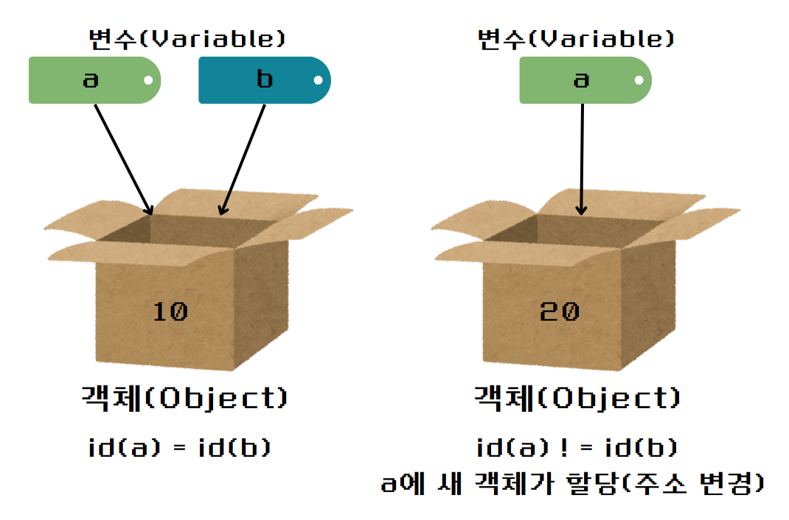

## 불변(immutable)과 가변(mutable) 객체


class |	설명	|구분
------|---------|-----
`list`	|mutable| 한 순서가 있는 객체 집합	|mutable
`set`|	mutable| 한 순서가 없는 고유한 객체 집합	|mutable
`dict`	|key와 value가 맵핑된 객체, 순서 없음|	mutable
`bool`|	참,거짓	|immutable
`int`	|정수	|immutable
`float`|	실수	|immutable
`tuple`|	immutable 한 순서가 있는 객체 집합|	immutable
`str`	|문자열	|immutable
`frozenset`|	immutable한 set|	immutable

* 객체란
  * 주소값: 객체를 고유하게 식별해주는 값
    ```python
    a = 10
    print("a의 identity: {}".format(id(a)))
    # a의 identity: 140710182679624

  * 타입: 객체가 어떤 유형에 속하는지
    ```python
    a = 10
    print("a의 type: {}".format(type(a)))
    # a의 type: <class 'int'>
    ```
  * 값(value): 어떤 객체를 선언했을 때, 값이 바뀌면 mutable이고 바뀌지 않으면 immutable 객체. immutable 객체의 값은 바뀔 수 없기 때문에 값을 바꾸려면 새로운 객체를 생성해야 함.
    ```python
    a = 10
    print("a의 identity: {}".format(id(a)))

    b = 10
    print("b의 identity: {}".format(id(b)))

    # a의 identity: 140710182679624
    # b의 identity: 140710182679624
    ```
    &rightarrow; a와 b는 다른 변수인데, 주소값이 같은 것을 볼 수 있다. 파이썬에서는 자주 사용되는 정수를 프로그램 시작과 함께 메모리에 자동 할당하고, 같은 값을 가리키는 변수의 주소값들은 한 곳에 바인딩하기 때문! 즉, '정수 10'이라는 객체에 a와 b의 주소값이 바인딩되었다고 생각하면 된다.

    

        * 값이 커지거나 복잡해지면 같은 값을 같더라도 다른 값으로 인식하여 새로운 객체를 생성하는 경우가 생김

* mutable
    ```python
    a = [2]
    print("a의 identity: {}, 값:{}".format(id(a),a))

    a.append(3)
    print("a의 identity: {}, 값:{}".format(id(a),a))

    # a의 identity: 2320408134848, 값:[2]
    # a의 identity: 2320408134848, 값:[2, 3]
    ```
   * 주소값이 동일한 것을 확인할 수 있다. 이는 '2320408134848'메모리에 있는 객체 안의 값을 바꿨다고 볼 수 있다.

## 얕은 복사
객체의 참조값, 흔히 말하는 주소값만 복사하는 것을 의미한다. 객체의 주소값을 복사하기 때문에 복사 대상의 값이 바뀌면 복사한 값도 바뀌게 된다. 결과적으로 두 변수 간 독립성이 성립하지 않게 된다. 

* mutable한 객체의 변수 간 대입
    ```python
    a = [1, 2, 3]
    b = a # shallow copy
    b[0]= 5
    print(a) # [5, 2, 3]
    print(b) # [5, 2, 3]
    print(id(a)) # 2175808924416
    print(id(b)) # 2175808924416
    ```
* immutable한 객체의 변수간 대입
  ```python
    a = "abc"
    b = a
    print(a) # abc
    print(b) # abc
    print(id(a)) # 140710181310816
    print(id(b)) # 140710181310816
    b = 'abcd'
    print(a) # abc
    print(b) # abcd
    print(id(a)) # 140710181310816
    print(id(b)) # 2175805781360
    ```
&rightarrow; immutable 객체는 자동으로 변수의 독립성을 보장해 주므로, mutable 객체에 대해서만 얕은 복사와 깊은 복사를 신경쓰면 된다.

## 깊은 복사
다른 메모리 공간에 값을 복사함으로써, mutable 객체의 독립성을 유지해 주는 역할을 한다.

copy 모듈의 deepcopy()를 사용하여 깊은 복사를 할 수 있다.

```python
import copy
a = [1,2,3]
b = copy.deepcopy(a)
print(a,b) # [1, 2, 3] [1, 2, 3]
print(id(a), id(b)) # 2175808717888 2175808871104
```

