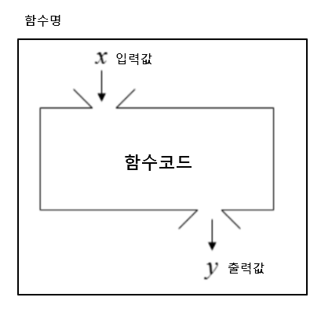

## 함수
특정 작업을 수행하기 위한 재사용 가능한 코드 묶음
* 함수를 사용하는 이유
  * 두 수의 합을 구하는 함수를 정의하고 사용함으로써 코드의 중복을 방지
  * 재사용성이 높아지고, 코드의 가독성과 유지보수성 향상
  
  ```python
  # 두 수의 합을 구하는 코드
  num1 = 5
  num2 = 3
  sum_result = num1 + num2

  print(sum_result)
  ```
  ```python
  # 두 수의 합을 구하는 함수
  def get_sum(num1, num2):
    return num1 + num2
  # 함수를 호출하여 결과 출력
  num1 = 5
  num2 = 3
  sum_result = get_sum(num1, num2)
  print(sum_result)
  ```

* 함수 호출 (function call)
  * 함수를 호출하기 위해 함수의 이름을 사용하여 해당 함수의 코드 블록을 실행하는 것
  * `function_name(arguments)`
## 함수 구조

```python
def make_sum(pram1, pram2):  # parameter (X입력값)
    """ 이것은 두 수를 받아
    두 수의 합을 반환하는 함수입니다.
    >>> make_sum(1,2)
    3"""
    return pram1 + pram2  # return value(y 출력값)
```
```python
    # Docstring
    """ 이것은 두 수를 받아
    두 수의 합을 반환하는 함수입니다.
    >>> make_sum(1,2)
    3"""
```
```python
    # function body
    """ 이것은 두 수를 받아
    두 수의 합을 반환하는 함수입니다.
    >>> make_sum(1,2)
    3"""
    return pram1 + pram2
```
## 함수 정의와 호출
* 함수 정의
  * 함수 정의는 def 키워드로 시작
  * def 키워드 이후 함수 이름 작성
  * 괄호 안에 매개변수를 정의할 수 있음
  * 매개변수(parameter)는 함수에 전달되는 값
* 함수 body
  * 콜론(:) 다음에 들여쓰기 된 코드 블록
  * 함수가 실행 될 때 수행되는 코드를 정의
* Docstring
  * 함수 body 앞에 선택적으로 작성 가능한 함수 설명서
* 함수 반환 값
  * 함수는 필요한 경우 결과를 반환할 수 있음
  * return 키워드 이후에 반환할 값을 명시
  * return 문은 함수의 실행을 종료하고, 결과를 호출 부분으로 반환
  * 함수 내에서 return 문이 없다면 None이 반환됨
* 함수 호출
  * 함수를 호출하기 위해서는 호출이 필요
  * 함수의 이름과 소괄호를 활용해 호출
  * 필요한 경우 인자(argument)를 전달해야 함
  * 호출 부분에서 전달된 인자는 함수 정의 시 작성한 매개변수에 대입됨
  
## 함수와 반환 값
* print() 함수는 반환 값이 없다
  * 화면에 값을 출력하기만 할 뿐, 반환(return)값이 없음
  * 파이썬에서 반환 값이 없는 함수는 기본적으로 None을 반환한다고 간주되기 때문
  
&rightarrow; 출력을 담당하는 함수는 결과를 반환하지 않으므로 내부적으로 아무값도 반환하지 않는 함수와 마찬가지로 None이 나옴

```python
return_value = print(1)
print(return_value) # None
```
```python
def my_func():
    print('hello')
result = my_func()
print(result) # None
```
## 매개변수와 인자
* 매개변수(parameter)
  * 함수를 정의할 때, 함수가 받을 값을 나타내는 변수
* 인자(argument)
  * 함수를 호출할 때, 실제로 전달되는 값
```python
def add_numbers(x,y):  # x와 y는 매개변수
    result = x + y
    return result

a = 2
b = 3

sum_result = add_numbers(a,b) # a와 b는 인자

print(sum_result)
```
* 인자 종류
  * 위치 인자 (Positional Arguments)
    * 함수 호출 시 인자의 위치에 따라 전달되는 인자
    * 위치 인자는 함수 호출 시 반드시 값을 전달해야 함
    * ```python
        def greet(name, age):
            print(f'안녕하세요, {name}님! {age}살이시군요.')
        
        greet('Alice', 25) # 안녕하세요, Alice님! 25살이시군요.
        greet(25, 'Alice') # 안녕하세요, 25님! Alice살이시군요.
        greet('Alice') # TypeError: greet() missing 1 required positional argument: 'age'
        ```
  * 기본 인자 값 (Default Argument values)
    * 함수 정의에서 매개변수에 기본 값을 할당하는 것
    * 함수 호출 시 인자를 전달하지 않으면, 기본값이 매개변수에 할당됨
    * ```python
        def greet(name, age = 30):
            print(f'안녕하세요, {name}님! {age}살이시군요.')

        greet('Bob') # 안녕하세요, Bob님! 30살이시군요.
        greet('Charlie', 40)  # 안녕하세요, Charlie님! 40살이시군요.
  * 키워드 인자 (Keyword Arguments)
    * 함수 호출 시 인자의 이름과 함께 값을 전달하는 인자
    * 매개변수와 인자를 일치시키지 않고, 특정 매개변수에 값을 할당할 수 있음
    * 인자의 순서는 중요하지 않으며, 인자의 이름을 명시하여 전달
    * 단, 호출 시 키워드 인자는 위치 인자 뒤에 위치해야 함
    * ```python
        def greet(name, age):
            print(f'안녕하세요, {name}님! {age}살이시군요.')
        
        greet(name = 'Dave', age = 35) # 안녕하세요, Dave님! 35살이시군요.
        greet(age = 35, name = 'Dave') # 안녕하세요, Dave님! 35살이시군요.\

        greet(age = 35, 'Dave') # Positional argument cannot appear after keyword arguments
        ```
  * 임의의 인자 목록 (Arbitary Argument Lists)
    * 정해지지 않은 개수의 인자를 처리하는 인자
    * 함수 정의 시 매개변수 앞에 '*'를 붙여 사용
    * 여러 개의 인자를 tuple로 처리
    * ```python
        def calculate_sum(*args):
            print(args) # (1, 100, 5000. 30)
            print(type(args)) # <class 'tuple>
        
        calculate_sum(1, 100, 5000, 30)
        ```
  * 임의의 키워드 인자 목록 (Arbitary Keyword Arguments Lists)
    * 정해지지 않은 개수의 키워드 인자를 처리하는 인자
    * 함수 정의 시 매개변수 앞에 '**'를 붙여 사용
    * 여러 개의 인자를 dictionary로 묶어 처리
    * ```python
        def print_info(**kwargs):
            print(kwargs)
        
        print_info(name = 'Eve', age = 30)
        # {'name': 'Eve', 'age': 30}
        ```
* 함수 인자 권장 작성 순서
  * 위치 &rightarrow; 기본 &rightarrow; 가변 &rightarrow; 가변 키워드
  * 호출 시 인자를 전달하는 과정에서 혼란을 줄일 수 있도록 함
  * 단, 모든 상황에서 적용되는 절대적인 규칙은 아니며, 상황에 따라 유연하게 조정될 수 있음
  * ```python
        def func(pos1, pos2, default_arg = 'default', *args, **kwargs):
            ...
    ```
* 인자의 모든 종류를 적용한 예시
```python
def func(pos1, pos2, default_arg = 'default', *args, **kwargs):
    print('pos1:', pos1)
    print('pos2:', pos2)
    print('default_arg:', default_arg)
    print('args:', args)
    print('kwargs:', kwargs)

func(1, 2, 3, 4, 5, 6, key1 = 'value1', key2 = 'value2')

"""
pos1: 1
pos2: 2
default_arg: 3
args: (4, 5, 6)
kwargs: {'key1': 'value1', 'key2': 'value2'}
"""
# 타입 변환을 강제할 수는 없지만 가이드는 줄 수 있다
def make_sum(pram1: int, pram2: str): -> int
```
## 재귀 함수
함수 내부에서 자기 자신을 호출하는 함수

* 팩토리얼
  * 자기 자신을 재귀적으로 호출하여 입력된 숫자 n의 팩토리얼을 계산
  * 재귀 호출은 n이 0이 될 때까지 반복되며, 종료 조건을 설정하여 재귀 호출이 멈추도록 함
  * 재귀 호출 결과를 이용하여 문제를 작은 단위의 문제로 분할하고, 분할된 문제들의 결과를 조합하여 최종 결과를 도출
  * ```python
        def factorial(n):
            if n == 0:
                return 1
            else:
                return n * factorial(n-1)
        print(factorial(5)) # 120
    ```

* 특징
  * 특정 알고리즘 식을 표현할 때 변수의 사용이 줄어들며, 코드의 가독성이 높아짐
  * 1개 이상의 base case(종료되는 상황)가 존재하고, 수렴하도록 작성

* 반 드 시!
  * 종료 조건을 명확히 하기
  * 반복되는 호출이 종료 조건을 향하도록 할 것

> * 재귀 함수는 메모리 사용량이 많고 느릴 수 있다
> * 종료 조건이 잘못되면 스택 오버플로우(작업 공간에 일이 너무 많이 쌓여 프로그램이 멈추는 오류)에러가 발생할 수 있으니 주의해야 한다
> * 복잡한 재귀 함수는 오히려 코드의 가독성을 저하시킬 수 있다 

* 재귀 함수를 사용하는 이유
  * 문제의 자연스러운 표현
    * 복잡한 문제를 간결하고 직관적으로 표현 가능
  * 코드 간결성
    * 상황에 따라 반복문보다 알고리즘 코드가 더 간결하고 명확해질 수 있음
  * 수학적 문제 해결
    * 수학적 정의가 재귀적으로 표현되는 경우, 직접적인 구현 가능

## 내장 함수
파이썬이 기본적으로 제공하는 함수(별도의 import 없이 바로 사용 가능)

* 자주 사용되는 내장 함수
```python
numbers = [1, 2, 3, 4, 5]

print(numbers) # [1, 2, 3, 4, 5]
print(len(numbers)) # 5
print(max(numbers)) # 5
print(min(numbers)) # 1
print(sum(numbers)) # 15
print(sorted(numbers, reverse = True)) # [5, 4, 3, 2, 1]
```
## 함수와 Scope
함수는 코드 내부에 local scope(지역 변수)를 생성하며, 그 외의 공간인 global scope(전역 변수)로 구분

* 범위와 변수 관계
  * scope
    * global scope: 코드 어디에서든 참조할 수 있는 공간
    * local scope: 함수가 만든 scope(함수 내부에서만 참조 가능)
  * variable
    * global variable: global scople에 정의된 변수
    * local variable: local scope에 정의된 변수

* Scope 예시
  * num은 local scope에 존재하기 때문에 global scope에서 사용할 수 없음 &rightarrow; 이는 변수의 수명주기와 연관이 있음
    ```python
    def func():
        num = 20
        print('local', num) # local 20
    
    func()

    print('global', num) # NameError: name 'num' is not defined

* 변수 수명주기(lifeycle)
  * 변수의 수명주기는 변수가 선언되는 위치와 scope에 따라 결정됨
  * built-in scope
    * 파이썬이 실행된 이후부터 영원히 유지
  * global scope
    * 모듈이 호출된 시점 이후 혹은 인터프리터가 끝날 때까지 유지
  * local scope
    * 함수가 호출될 때 생성되고, 함수가 종료될 때까지 유지
* 이름 검색 규칙 (Name Resolution)
  * 파이썬에서 사용되는 이름(식별자)들은 특정한 이름공간(namespace)에 저장되어 있음
  * 아래와 같은 순서로 이름을 찾아 나가며, LEGB Rule 이라고 부름
    * Local scope: 지역 범위(현재 작업 중인 범위)
    * Enclosed scope: 지역 범위 한 단계 위 범위
    * Global scope: 최상단에 위치한 범위
    * Built-in scope: 모든 것을 담고 있는 범위
        (정의하지 않고 사용할 수 있는 모든 것)
  * 함수 내에서는 바깥 scope의 변수에 접근 가능하나 수정은 할 수 없음

* LEGB Rule 예시
  * sum이라는 이름을 global scope에서 사용함으로써, 기존 built-in scope에 있던 내장함수 sum을 사용하지 못하게 됨
  &rightarrow; sum을 참조 시 LEGB Rule에 따라 global에서 먼저 찾기 때문
  ```python
  print(sum) # <built-in function sum>
  print(sum(range(3))) # 3

  sum = 5

  print(sum) # 5
  print(sum(range(3)))  # TypeError: 'int' object is not callable
  # del sum으로 삭제하고 다시...
  ```
  ```python
    # LEGB Rule 퀴즈
    x = 'G'
    y = 'G'


    def outer_func():
        x = 'E'
        y = 'E'

        def inner_func(y):
            z = 'L'
            print(x, y, z)  # E P L

        inner_func('P')
        print(x, y)  # E E


    outer_func()
    print(x, y)  # G G
    ```
    ```
    전역(Global)
    │
    ├─ x = 'G'
    ├─ y = 'G'
    │
    ├─ outer_func()
    │   ├─ x = 'E'      ← Enclosing (inner_func에서 사용되는 x)
    │   ├─ y = 'E'      ← Enclosing (하지만 inner_func에서는 덮어씀)
    │   │
    │   ├─ inner_func('P')
    │   │   ├─ y = 'P'   ← Local (매개변수로 전달된 값)
    │   │   ├─ z = 'L'   ← Local
    │   │   └─ print(x, y, z)
    │   │            ↑  ↑  ↑
    │   │            E  P  L
    │   │            │  │  │
    │   │            │  │  └── Local (z)
    │   │            │  └────── Local (y)
    │   │            └────────── Enclosing (x)
    │   │
    │   └─ print(x, y)
    │            ↑  ↑
    │            E  E   ← outer_func 내부 변수
    │
    └─ print(x, y)
             ↑  ↑
             G  G   ← 전역 변수
    ```

## global 키워드
* 변수의 스코프를 전역 범위로 지정하기 위해 사용
* 일반적으로 함수 내에서 전역 변수를 수정하려는 경우에 사용

```python
num = 0 # 전역 변수

def increment():
    global num # num을 전역 변수로 선언
    num += 1

print(num) # 0
increment()
print(num) # 1
```
* 주의 사항
  * global 키워드 선언 전에 참조 불가
  * 매개변수에는 global 키워드 사용 불가

## 함수 스타일 가이드
* 기본 규칙
  * 소문자와 언더스코어(_) 사용
  * 동사로 시작하여 함수의 동작 설명
  * 약어 사용 지양
* 함수 이름 구성 요소
  * 동사 + 명사
    * save_user()
  * 동사 + 형용사 + 명사
    * calculate_total_price()
  * get/set 접두사
    * get_username(), set_username()
> True/False를 반환한다면 is 또는 has 로 시작하는 것을 추천

## 단일 책임 원칙
모든 객체는 하나의 명확한 목적과 책임만을 가져야 함

* 함수 설계 원칙
  * 명확한 목적
    * 함수는 한 가지 작업만 수행
    * 함수 이름으로 목적을 명확히 표현
  * 책임 분리
    * 데이터 검증, 처리, 저장 등을 별도 함수로 분리
    * 각 함수는 독립적으로 동작 가능하도록 설계
  * 유지보수성
    * 작은 단위의 함수로 나누어 관리
    * 코드 수정 시 영향 범위를 최소화

* 잘못된 설계 예시
  * 여러 책임이 섞인 함수
  ```python
  def process_user_data(user_data):
    # 책임 1: 데이터 유효성 검사
    if len(user_data['password']) < 8:
        raise ValueError('비밀번호는 8자 이상이어야 합니다')

    # 책임 2: 비밀번호 암호화 및 저장
    user data['password'] =  hash_password(user_data['password'])
    db.users.insert(user_data)

    # 책임 3: 이메일 발송
    send_email(user_data['email'], '가입을 환영합니다!')
    ```
  * 책임을 분리한 함수들
    ```python
    def validation_password(password):
        """비밀번호 유효성 검사"""
        if len(password) < 8:
            raise ValueError('비밀번호는 8자 이상이어야 합니다')
    
    def save_user(user_data):
        """비밀번호 암호화 및 저장"""
        user_data['password'] =  hash_password(user_data['password'])
        db.users.insert(user_data)
    
    def send_welcome_email(email):
        """환영 이메일 발송"""
        send_email(email, '가입을 환영합니다')

    # 메인 함수에서 순차적으로 실행
    def process_user_data(user_data):
        validate_password(user_data['password'])
        save_user(user_data)
        send_welcome_email(user_data['email'])
    ```

## Packing & Unpacking
### Packing
여러 개의 데이터를 하나의 컬렉션으로 모아 담는 과정
> 기본 원리
> * 여러 개의 값을 하나의 튜플로 묶는 파이썬의 기본 동작
> * 한 변수에 콤마(,)로 구분된 값을 넣으면 자동으로 튜플로 처리

* '*' 을 활용한 패킹 (함수 매개변수 작성 시)
  * 남는 위치 인자들을 튜플로 묶기
  * *를 붙인 매개변수가 남는 위치 인자들을 모두 모아 하나의 튜플로 만듦
  ```python
    def my_func(*args):
        print(args) # (1,2,3,4,5)
        print(type(args)) # <class 'tuple'>

    my_func(1, 2, 3, 4, 5)
    ```
* '**' 을 활용한 패킹 (함수 매개변수 작성 시)
  * 남는 키워드 인자들을 딕셔너리로 묶기
  * **를 붙인 매개변수가 남는 키워드 ㅇ니자들을 모두 모아 하나의 딕셔너리로 만듦
  ```python
    def my_func2(**kwargs):
        print(kwargs) # {'a': 1, 'b': 2, 'c': 3}
        print(type(kwargs)) # <class 'dict>
    
    my_func2(a = 1, b = 2, c =3)
    ```
* print 함수의 패킹 예시
  * print 함수에서 임의의 가변 인자를 작성할 수 있었던 이유 &rightarrow; 인자 개수에 상관 없이 튜플 하나로 패킹 돼서 내부에서 처리
  ```python
    def my_func(*objects):
        print(objects) # (1, 2, 3, 4, 5)
        print(type(objects)) # <class 'tuple'>
    
    my_func(1, 2, 3, 4, 5)
    ```

### Unpacking
컬렉션에 담겨있는 데이터들을 개별 요소로 펼처 놓는 과정
> 기본 원리
> * 튜플이나 리스트 등의 객체의 요소들을 개별 변수에 할당
> '시퀀스 언패킹(Sequence Unpacking)' 또는 '다중 할당(Multiple Assignment)'이라고 부름

* '*' 을 활용한 패킹 (함수 인자 전달)
  * 리스트나 튜플 앞에 *를 붙여 각 요소를 함수의 개별 위치 인자로 전달
  ```python
    def my_function(x, y, z):
        print(x, y, z)


    names = ['alice', 'jane', 'peter']
    my_function(*names)  # alice jane peter
    ```
* '**' 을 활용한 언패킹 (딕셔너리 &rightarrow; 함수 키워드 인자)
  * 딕셔너리 앞에 **를 붙여 {키:값}쌍을 키=값 형태의 키워드 인자로 전달
  ```python 
    def my_function(x, y, z):
        print(x, y, z)


    my_dict = {'x': 1, 'y': 2, 'z': 3}
    my_function(**my_dict)  # 1 2 3
    ```
## 함수와 반환
* 함수의 return, 반환의 원칙
  * 파이썬 함수는 언제나 단 하나의 값(객체)만 반환할 수 있음
  * 여러 값을 반환하는 경우에도 하나의 튜플로 패킹하여 반환

```python
def get_user_info():
    name = 'Alice'
    age = 30
    # 콤마(,)로 여러 값을 반환하는 것처럼 보임
    return name, age


# 하지만 반환된 값을 user_data변수에 담아 확인해보면
user_data = get_user_info()

# 단 하나의 튜플을 반환하는 것 입니다.
print(user_data)  # ('Alice', 30)
```
* 핵심
  * 파이썬 함수는 오직 하나의 값(객체)만 return 할 수 있음
  * return a,b,c 처럼 콤마를 사용하면, 파이썬 값들을 하나의 튜플로 자동 패킹하여 반환
  * 반환된 튜플은 각 변수에 언패킹하여 사용할 수 있음

## 람다 표현식
익명 함수를 만드는 데 사용되는 표현식

한 줄로 간단한 함수를 정의

* 구조
  * lambda 키워드
    * 람다 함수를 선언하기 위해 사용되는 키워드
  * 매개변수
    * 함수에 전달되는 매개변수들
    * 여러 개의 매개변수가 있을 경우 쉼표로 구분
  * 표현식
    * 함수의 실행되는 코드 블록으로, 결과값을 반환하는 표현식으로 작성
  
```python
# 변경 전
def addition(x, y):
    return x + y

# 변경 후
lambda x, y: x + y
```
```python
# 변경 전 활용
result = addition(3, 5)
print(result)  # 8

# 변경 후 활용
addition = lambda x, y: x + y
result = addition(3, 5)
print(result)  # 8
```
```python
# 람다 표현식 활용 - 1 (with map 함수)
numbers = [1, 2, 3, 4, 5]


def square(x):
    return x**2


# lambda 미사용
squared1 = list(map(square, numbers))
print(squared1)  # [1, 4, 9, 16, 25]

# lambda 사용
squared2 = list(map(lambda x: x**2, numbers))
print(squared2)  # [1, 4, 9, 16, 25]
```
```python
"""
람다 표현식 활용 - 2 (with sorted 함수)
sorted() 함수는 리스트를 정렬해주며, key라는 매개변수에 함수를 전달하여 
"무엇을 기준으로 정렬할지"를 지정할 수 있습니다. 
이때 간단한 기준을 제시하기 위해 lambda를 사용하는 것이 매우 효과적입니다.

예시: 학생들의 점수를 나이순으로 정렬하기
학생 데이터가 (나이, 점수) 형태의 튜플로 묶여있는 리스트가 있다고 가정해 봅시다

# 목표: 학생들을 '나이'가 어린 순서대로 정렬하고 싶다!
"""
students = [(21, 90), (19, 95), (25, 85)]


# 1. lambda 미사용 (일반 함수 정의)
# 정렬의 기준(key)이 될 함수를 미리 정의
def get_age(student_data):
    # student_data는 (21, 90) 같은 튜플
    # 나이는 0번 인덱스에 있으므로, student_data[0]을 반환
    return student_data[0]


# sorted 함수의 key 매개변수에 우리가 만든 get_age 함수를 전달
sorted_students = sorted(students, key=get_age)
print(sorted_students)  # [(19, 95), (21, 90), (25, 85)]


# 2. lambda 사용
"""
get_age처럼 간단하고 한 번만 쓸 함수를 굳이 따로 정의할 필요 없이, lambda로 즉석에서 만들어 전달할 수 있습니다.
key=lambda student_data: student_data[0]
-> "정렬할 때 각 데이터를 student_data라고 부를게."
-> "그리고 그 데이터의 0번 인덱스 값(나이)을 기준으로 삼아줘."
"""
sorted_students = sorted(students, key=lambda student_data: student_data[0])
print(sorted_students)  # [(19, 95), (21, 90), (25, 85)]
```
